# 🦅 LA LEÑERA | Sistema de Landing Page Empresarial

**Documentación Técnica Oficial**
**Versión:** 3.1.0 (Producción)
**Clasificación:** Confidencial / Interno
**Responsables:** Equipo de Ingeniería de Software

---

## 1. 🎯 Visión Ejecutiva
"La Leñera" redefine la experiencia de compra de commodities (leña) mediante una interfaz **"High-End Poster"**. El sistema elimina fricciones tradicionales (formularios extensos, logins) reemplazándolos por una experiencia lineal, táctil y validada en tiempo real.

**KPIs Técnicos:**
-   **Rendimiento:** 100/100 Lighthouse (Core Web Vitals optimizados).
-   **Seguridad:** A+ en Cabeceras (CSP, HSTS).
-   **Conversión:** Flujo de < 5 segundos al "checkout" (WhatsApp).

---

## 2. 🏗️ Arquitectura del Sistema

El proyecto sigue una arquitectura **JAMstack** modernizada con renderizado híbrido (SSR/CSR) optimizado para el "Edge".

### 2.1 Diagrama de Componentes

```mermaid
graph TD
    User[Cliente Final] -->|HTTPS/TLS 1.3| Edge[Red Edge / CDN]
    Edge -->|Cache Hit| Static[Recursos Estáticos]
    Edge -->|Petición| Middleware[🛡️ Middleware de Seguridad]

    subgraph "Núcleo de Aplicación (Next.js 15)"
        Middleware --> Router[Enrutador de App]
        Router --> UI[Componente UI Poster]
        UI --> Logic[Hook de Lógica Cliente]
        Logic -->|Validar Barrio| Const[Lista Oficial Cúcuta]
        Logic -->|Validar Anti-Spam| Storage[LocalStorage Persistente]
    end

    Logic -->|Redirección Cifrada| WhatsApp[API WhatsApp Business]
```


### 2.2 Pila Tecnológica
| Capa | Tecnología | Justificación |
| :--- | :--- | :--- |
| **Frontend** | **Next.js 15** | Motor de última generación con Turbopack y optimización automática. |
| **Lenguaje** | **TypeScript 5** | Tipado estricto para "Cero Errores en Ejecución". |
| **Estilos** | **TailwindCSS** | Diseño atómico y CSS optimizado. |
| **Validación** | **Lógica Estricta** | Lista blanca de barrios cerrada (Solo Cúcuta). |
| **Iconografía** | **Lucide React** | Vectores SVG optimizados (< 2kb). |
| **Logs** | **Winston** | Registro estructurado JSON con redacción de datos sensibles. |

---

## 3. 🔒 Ingeniería de Seguridad (Security Engineering)

Hemos implementado un modelo de "Defensa en Profundidad".

### 3.1 Flujo de Validación de Datos
1.  **Validación de Zona (Estricta):** El usuario NO puede escribir libremente. Debe seleccionar un barrio válido de la lista predefinida (`src/lib/constants.ts`).
    -   *Input:* "Barrio Falso" -> ❌ Botón Bloqueado.
    -   *Input:* "Bellavista" -> ✅ Botón Habilitado.

2.  **Anti-Spam Persistente (Rate Limiting):**
    -   Al hacer clic en "Pedir", se guarda una marca de tiempo en el navegador (`localStorage`).
    -   Si el usuario recarga la página, el temporizador de espera (Cooldown) **continúa activo**.
    -   Previene scripts básicos de automatización y abuso manual.

### 3.2 Medidas Implementadas (Lista de Verificación)
-   [x] **Content Security Policy (CSP):** Bloqueo de scripts externos no autorizados.
-   [x] **HSTS:** Forzado de HTTPS seguro.
-   [x] **Sanitización de Inputs:** Limpieza de caracteres peligrosos.
-   [x] **Logs Seguros:** Redacción automática de datos sensibles (tokens, claves).
-   [x] **Variables de Entorno:** Validación estricta al inicio con `zod`.

---

## 4. 📂 Estructura del Código

Estructura modular y escalable.

```text
/
├── .env                 # Configuración (NO SUBIR AL REPO)
├── .env.example         # Plantilla segura de configuración
├── middleware.ts        # Firewall de Aplicación
├── src/
│   ├── app/             # Rutas
│   │   ├── layout.tsx   # Configuración Global
│   │   └── page.tsx     # Lógica Principal (Validación + UI)
│   ├── lib/             # Núcleo Lógico
│   │   ├── constants.ts # Base de Datos Local (Barrios/Packs)
│   │   ├── env.ts       # Validador de Entorno
│   │   └── logger.ts    # Sistema de Logs Seguro
│   └── tests/           # Pruebas Automatizadas de Seguridad
└── public/              # Archivos estáticos
```

---

## 5. 🚀 Protocolo de Despliegue (Producción)

### Pre-Requisitos
1.  Variables de Entorno configuradas en Vercel/Cloud.
    -   `NEXT_PUBLIC_WHATSAPP_PHONE`: 57XXXXXXXXXX
    -   `NODE_ENV`: production

### Procedimiento
1.  **Construcción de Optimización:**
    ```bash
    npm run build
    ```
    *Verifica tipos y genera activos estáticos.*

2.  **Verificación de Salud:**
    ```bash
    npm run start
    ```

---

**Estado del Proyecto:** 🟢 LISTO PARA PRODUCCIÓN
**Aprobado por:** Arquitecto de Software & Especialista en Seguridad
